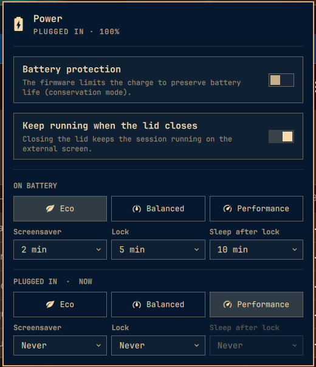

# Omarchy BetterPower

An [Omarchy](https://omarchy.org) shell plugin that turns power management into one explicit
strategy per power source. For battery and for plugged in you pick a power profile, a
screensaver delay, a lock delay and a sleep delay. On top: a battery protection toggle and a
clamshell toggle that keeps the session running with the lid closed on an external screen.

The panel follows the active Omarchy theme and is fully keyboard driven.



## Install

```bash
omarchy plugin add git@github.com:leakim34/omarchy-betterpower.git --enable
```

Plugins run unsandboxed inside `omarchy-shell`. Read the code before enabling; it is short.

The plugin sits alongside the first-party Power widget. Both agree on the active profile,
so keep both or remove `omarchy.power` from `~/.config/omarchy/shell.json` once you are settled.

## What it does

| Feature | Mechanism |
|---|---|
| Power profile per source | `omarchy-powerprofiles-set`, the same state files the first-party battery service re-applies on every source switch |
| Screensaver and lock delay per source | `idle.screensaver` and `idle.lock` in `shell.json`, read live by the first-party idle service. "Never" on both enables stay-awake (the coffee-cup indicator) |
| Sleep after lock | An idle monitor armed only while the session is locked; runs `systemctl suspend`. Respects idle inhibitors. Never on a source whose lock is never |
| Battery protection | UPower's `EnableChargeThreshold`, allowed for the active session by polkit. Shown only when the battery reports charge control; the wording follows what the hardware supports (a firmware conservation mode, or a stop threshold) |
| Keep running when the lid closes | A `systemd-inhibit --what=handle-lid-switch` inhibitor held by the shell while the toggle is on and an external screen is connected. Released on disconnect, on disable and when the shell exits |

Nothing needs root. Nothing is written at startup: the plugin waits two seconds, remembers what
is already in effect, and only acts on a power source switch or a change you make.

## Settings

Inline on the plugin's entry in `~/.config/omarchy/shell.json`, editable from the panel or the
shell's plugin settings screen. Delays are seconds; `0` means never.

| Key | Default | Meaning |
|---|---|---|
| `batteryProfile` | `power-saver` | Profile on battery |
| `batteryScreensaver` | `120` | Screensaver delay on battery |
| `batteryLock` | `300` | Lock delay on battery |
| `batterySleep` | `600` | Sleep delay after lock on battery |
| `acProfile` | `performance` | Profile plugged in |
| `acScreensaver` | `0` | Screensaver delay plugged in |
| `acLock` | `0` | Lock delay plugged in |
| `acSleep` | `0` | Sleep delay after lock plugged in |
| `clamshell` | `On` | Hold the lid inhibitor while an external screen is connected |
| `barMode` | `off` | What the bar entry shows besides the icon: `off`, `percentage`, `gauge` (a battery fill painted across the whole bar), or `both`. A right click on the icon cycles through them |

The battery protection state is not a setting: the firmware keeps it across reboots and the
panel shows UPower's live value.

Disabling the plugin removes its entry from `shell.json`, and with it these settings. That is
how Omarchy treats every third-party plugin.

## IPC

Target `leakz.betterpower`, through `omarchy-shell leakz.betterpower <method> [args]`:

| Method | Effect |
|---|---|
| `open`, `close`, `toggle` | Panel |
| `status` | JSON: source, strategy, applied state, charge state, inhibitor, cursor |
| `setProfile <battery\|ac> <profile>` | Persist, and apply when it is the current source |
| `setDelay <battery\|ac> <screensaver\|lock\|sleep> <seconds>` | Persist and apply |
| `setChargeLimit <true\|false>` | Toggle battery protection |
| `setClamshell <true\|false>` | Toggle the lid inhibitor |
| `setBarMode <off\|percentage\|gauge\|both>`, `cycleBarMode` | Bar display mode |

## Files touched

| Path | Owner | Written when |
|---|---|---|
| `~/.config/omarchy/shell.json` | Omarchy | Plugin settings on its own entry; `idle.screensaver` and `idle.lock` on a strategy change |
| `~/.local/state/omarchy/powerprofiles/{ac,battery}` | Omarchy | Profile choice per source |
| `~/.local/state/omarchy/indicators/stay-awake` | Omarchy | Through the idle service, when both delays are never |

No file of its own. Removal (`omarchy plugin remove leakz.betterpower`) leaves those values at what
was last applied; they are ordinary Omarchy settings you can change from the built-in panels.

## Hardware notes

- Lenovo (ideapad, Legion, Yoga): protection is the firmware conservation mode. Enabling then
  disabling it leaves the charge type at `Standard` even if it was `Fast` before; set it back with
  `echo Fast | sudo tee /sys/class/power_supply/BAT*/charge_types`.
- ThinkPad, ASUS, Framework: UPower reports start and end thresholds. The toggle enables them
  with the values UPower holds; picking a percentage is planned.
- No charge control reported: the control is replaced by a one-line note.

## Development

```bash
.kit/run test              # node tests over Model.js and the manifest validator
.kit/run lint              # manifest validation, qmlformat, shellcheck
.kit/run run               # link into ~/.config/omarchy/plugins and rescan
.kit/run run --restart     # restart the shell (needed after Panel.qml or Service.qml changes)
```

See `docs/architecture.md` and `docs/adr/` for the design.
